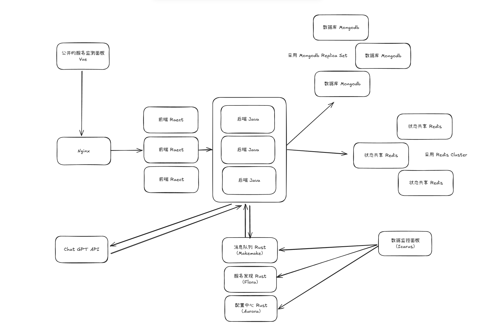

# 架构

## 架构设计

项目采用分布式设计，使用 MongoDB Replica Set 作为数据库、Redis 作为缓存件，而比较特殊的是 Redis 在负责各个节点间共享状态（如登录凭据）。配置中心、服务发现、消息队列为异步调用 ChatGPT API，后端将 ChatGPT API 请求压入消息队列中，等待节点空闲时再利用定时任务和多线程发起请求以避免等待 GPT 回复而维持长链接影响整体性能。[配置中心 Makemake](https://github.com/hanbings/icarus/tree/main/makemake)、[服务发现 Flora](https://github.com/hanbings/icarus/tree/main/flora)、[消息队列 Aurora](https://github.com/hanbings/icarus/tree/main/aurora) 是本项目基于 Raft 的实现，另外还提供了一个网页的[数据监控面板 Icarus](https://github.com/hanbings/icarus/tree/main/icarus) 用于维护。

## 分工

均由 [hanbings](https://github.com/hanbings) 一人完成。

